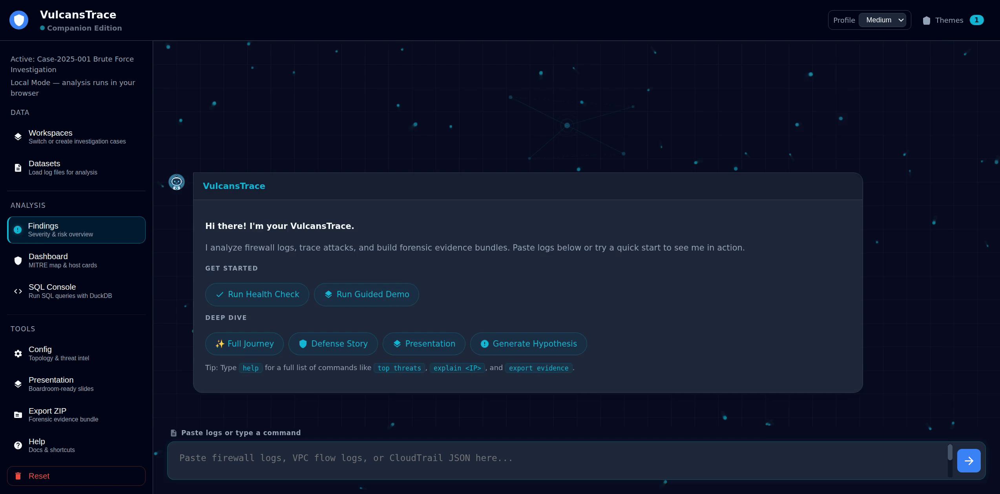

# VulcansTrace-Web

[](https://github.com/MVulcansTrace/VulcansTrace-Web/actions/workflows/deploy-pages.yml)
[](https://mvulcanstrace.github.io/VulcansTrace-Web/)
[](LICENSE)
[](package.json)
[](components/main.js)
[](vendor/duckdb/duckdb-esm.js)

Browser-based threat detection platform. Paste firewall logs and get instant analysis -- 10 detection badges, DuckDB SQL engine, automated evidence packaging, and a boardroom-ready presentation deck. No framework, no build step, and local-first analysis in your browser.

Built to demonstrate applied cybersecurity knowledge: detection logic, MITRE ATT&CK mapping, network forensics, and evidence chain handling.



---

## Running Locally

No build step and no framework. The checked-in app assets run from the local dev server.

```bash
git clone <repo-url>
cd VulcansTrace-Web
node tools/serve.mjs
```

Then open `http://localhost:7071` in your browser. Requires [Node.js](https://nodejs.org/) for the dev server only -- the app itself is pure HTML/JS/CSS.

You'll be prompted to create a workspace (investigation case) on first launch. Name it anything, then paste logs or run the Guided Demo to see detection in action.

## GitHub Pages

The public site is deployed with GitHub Actions to:

```text
https://mvulcanstrace.github.io/VulcansTrace-Web/
```

Every push to `main` publishes the checked-in browser assets from `index.html`, `assets`, `components`, `samples`, `styles`, and `vendor`. There is no build step.

---

## Detection Capabilities

| Detector | MITRE ATT&CK Technique | What it flags |
|---|---|---|
| **Scanner** | T1595 Reconnaissance | Source IP probing multiple ports |
| **Flooder** | T1498 Denial of Service | High-volume DROP activity from a single source |
| **Egress Anomaly** | T1048 Exfiltration Over Alt Protocol | Unusual outbound destination count or volume |
| **Lateral Movement** | T1021 Remote Services | Internal host touching multiple internal targets on admin ports |
| **Beacon** | T1071 Application Layer Protocol | Periodic connections to same dest:port with low jitter (C2 pattern) |
| **Exfiltration** | T1048 Exfiltration Over Alt Protocol | Outbound byte volume exceeding threshold |
| **Brute Force** | T1110 Brute Force | Rapid repeated connections to admin ports (SSH, RDP, SMB) within a sliding window |
| **Compromised Host** | State label (no direct ATT&CK technique) | Cross-reference: host registered as a brute-force/scanner target and also seen with outbound activity |
| **Attack Chain** | T1190 Exploit Public-Facing Application | DROP followed by ALLOW on same port across files within the chain window |
| **Threat Intel** | Evidence label (no direct ATT&CK technique) | IP match against manually loaded known-malicious IOC list |

### Sensitivity Profiles

Three profiles control detection sensitivity:

- **High** -- flags more activity, lower thresholds. Catches subtle attacks but may produce false positives on busy networks.
- **Medium** -- balanced (default). Tuned for demonstration clarity.
- **Low** -- higher thresholds. Reduces noise on high-volume production logs.

---

## Supported Log Formats

| Format | Parser | Notes |
|---|---|---|
| **Windows Firewall** | `pfirewall.log` parser | Handles both simplified (8-field) and native (17-column) formats. Validates action enum, protocol, IPv4/IPv6-shaped addresses, and port ranges. Network role/risk analysis is IPv4-oriented; non-loopback IPv6 rows parse but are marked invalid during analysis. |
| **AWS VPC Flow** | VPC Flow parser | 14+ field format with AWS account ID and ENI prefix detection. |
| **AWS CloudTrail** | CloudTrail JSON parser | Parses API audit events. Stored in DuckDB for SQL queries. Does not feed network-flow risk scoring (by design -- CloudTrail is API audit, not network flow). |
| **Generic W3C** | Hardened fallback | Catches structured logs that don't match a dedicated parser. Minimum 6 fields, validates actions, IPs, and ports. |

Parsers auto-detect format on paste. No configuration needed.

---

## Architecture

- **Pure vanilla JS ESM** -- no framework and no build step. Every component is a JS class exporting an ES module; DuckDB WASM is the only npm dependency, with browser assets vendored under `vendor/duckdb`.
- **Local-first analysis** -- default parsing, detection, SQL, evidence generation, and presentation run in the browser. No API keys or cloud services are required. IndexedDB stores workspaces, datasets, queries, snapshots, and transcripts.
- **DuckDB WASM** -- in-browser SQL engine for ad-hoc log hunting. Query your parsed data with full SQL against in-memory `flows`, `cloudtrail`, and `datasets` tables.
- **83 unit tests** across 24 test files -- parsers, detectors, MITRE mappings, agent skills, evidence generation, self-tests.
- **Presentation deck** -- 6-slide boardroom-ready output (Overview, Snapshot, Triage, Diff, Hypothesis, Remediation) generated deterministically from analysis state.

---

## Threshold Tuning Note

VulcansTrace-Web is a **demonstration tool**, not a production SIEM. Detector thresholds are tuned for clarity and educational value, not for deployment on live enterprise networks.

Specific considerations:

- **Egress thresholds** (Medium: 6 unique destinations, 5 MB bytes) are tight enough that a busy workstation or proxy server could trigger false positives. In production, these would be calibrated against network baselines.
- **Exfil and Egress overlap** -- both use outbound byte/destination counts, so a true exfiltration event typically triggers both badges. A production tool would apply whitelisting and baseline deviation instead of fixed thresholds.
- **Beacon detection** requires a minimum 60-second span. This correctly filters rapid bursts (normal browsing) but may miss slow C2 channels with intervals over 5 minutes if the capture window is short.
- **Brute force detection** uses a sliding window (Medium: 5 events in 30 seconds on admin ports). This works for SSH/RDP brute force but does not detect low-and-slow password spraying (1 attempt per minute over hours).
- **Compromised host detection** cross-references brute-force/scanner targets with outbound activity from the targeted host. It will not catch compromised hosts from attack vectors outside those target registries (e.g., phishing, exploit kits).
- **`rankRiskProfiles` caps at 50 hosts.** In datasets with hundreds of flagged IPs, hosts beyond rank 50 are excluded from the risk ranking. This is intentional to keep the UI and presentation deck readable.

The Low/Medium/High profile system lets users adjust sensitivity, but real-world deployment would require statistical baselining per network segment rather than static thresholds.

---

## Tech Stack

| Layer | Technology |
|---|---|
| Frontend | Vanilla JavaScript (ES Modules), HTML5, CSS3 |
| SQL Engine | DuckDB WASM (in-browser) |
| Storage | IndexedDB (workspaces, datasets, snapshots, transcripts) |
| Server | Node.js local dev server; optional localhost API demo server (`npm run dev:api`) |
| Testing | Node.js built-in test runner |
| License | Apache 2.0 |
